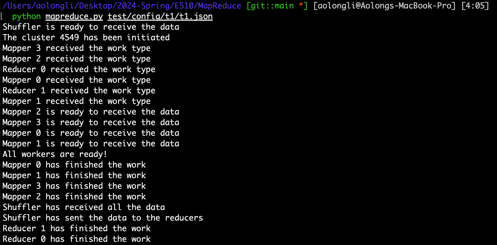
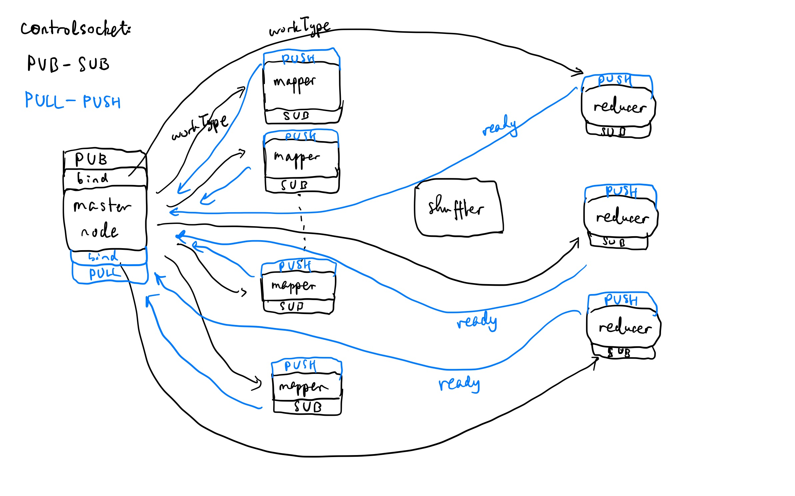
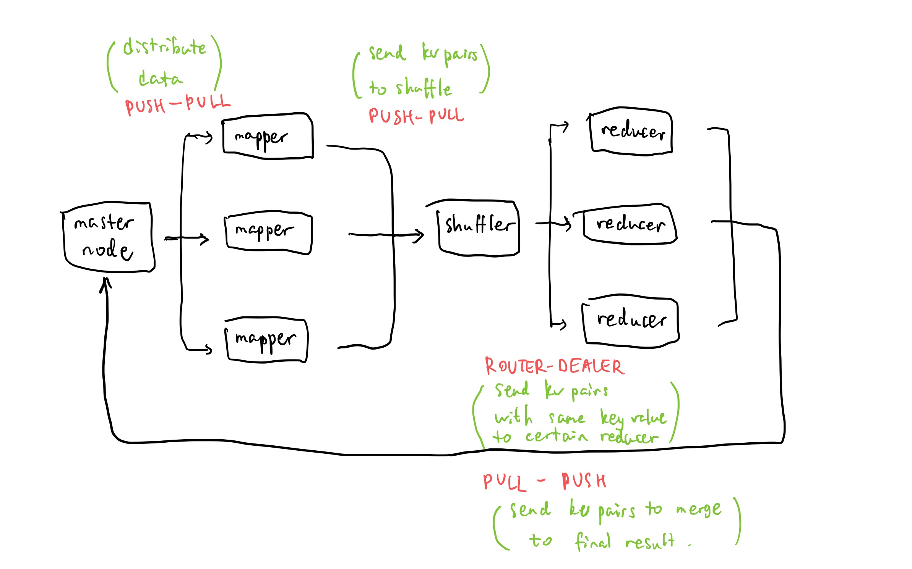

# MapReduce Implementation

## How to Test

For testing, we need to make sure ZeroMQ is installed, which we used for communication between processes. If not, we can install it by running the following command:

```zsh
pip install pyzmq
```
To run the test, we can use the following command:


```zsh
python3 mapreduce.py testconfig
```
where `testconfig` is the path to the test configuration file. The file should be in JSON format and contain the following fields:

- `numMappers`: the number of mappers
- `numReducers`: the number of reducers
- `workType`: the type of task, either `wordcount` or `invertedindex`
- `inputData`: the path to the input data
- `outputLocation`: the path to the output data
- `ports`: a list of ports for communication. We only need six port numbers thanks to ZeroMQ, which we will discuss more detail in the following sections (structure and design).

For example, to run the sample test case t1, we can use the following command:

```zsh
python3 mapreduce.py test/config/t1/t1.json
```
You will get output expected to like this:



## Structure of Files
- `mapreduce.py`: the main file for running the MapReduce program
- `mapper.py`: the script for the mapper process
- `reducer.py`: the script for the reducer process
- `shuffle.py`: the script for the shuffle process
- `test`: it contains the test configuration files and corresponding output files 
- `temp`: it contains the temporary files generated during the MapReduce process (testing), also they serve as the local storage for the workers. We can also check if the workload is distributed almost evenly or not by looking at each worker's temporary file.

    For example, 
    - `data_reducer_0_t1.txt` is the temporary file for reducer 0 in test case t1, and
    - `data_shuffler_t1.txt` is the temporary file for the shuffle process in test case t1, and so on.

For test case 4, since I changed the design of **shuffler** from that point and it no longer generate temporary file. 

## Communications with ZeroMQ
We use ZeroMQ to implement the communication between the master and the workers. ZeroMQ has serval patterns, request-reply, publish-subscribe, and push-pull, etc.

Here we mainly use three patterns: `PUSH`-`PULL`, `PUB`-`SUB`, and `ROUTER`-`DEALER`.

- `PUSH`-`PULL` (or `PULL`-`PUSH`) patterns:

    This pattern is used for parallel processing pipelines and load balancing workloads across multiple workers. It supports a one-way 1 to N flow of messages from producers to consumers.

    - `PUSH`: Distributes messages to the next available worker in a round-robin fashion.
    - `PULL`: Pulls messages from a PUSH socket. Workers using PULL sockets can process tasks in parallel, without knowing about each other. messages from a PUSH socket. Workers using PULL sockets can process tasks in parallel, without knowing about each other.

    The advantage of this pattern is that it can distribute the workload evenly among workers somewhat automatically. 
    
    Also, only one port number is needed to establish such a pattern. One can bind the `PUSH` (or `PULL`) socket to a port number, and more than one "clients" can connect to `PULL`(or `PUSH`) socket with the same port number.


- `PUB`-`SUB` patterns:
    
    This pattern is used for one-to-many messaging. It supports a one-way flow of messages from a single publisher to multiple subscribers in a fan-out fashion.

    - `PUB`: Publishes messages to subscribers. It can connect to multiple `SUB` sockets.
    - `SUB`: Subscribes to messages from one or more `PUB` sockets.

    The advantage of this pattern is that it can broadcast messages to multiple subscribers. 

    Also, only one port number is needed to establish such a pattern. One can bind the `PUB` socket to a port number, and more than one "clients" can connect to `SUB` socket with the same port number.

    The difference between `PUSH`-`PULL` and `PUB`-`SUB` is that the former one can only pass one message to one worker at a time (and you have no certain idea who will get the message and it basically depends who is not busy at that point), while the latter one can pass one message to all workers at the same time. This is useful when we need to broadcast the work type to all workers. 

- `ROUTER`-`DEALER` patterns:

    This pattern is used for asynchronous request-reply messaging. It supports bi-directional communication between multiple clients and servers.

    - `ROUTER`: Routes messages to the correct `DEALER` socket. It can connect to multiple `DEALER` sockets.
    - `DEALER`: Sends and receives messages from a `ROUTER` socket.

    The advantage of this pattern is that it can handle multiple clients and servers and it is bidirectional. So it is useful when we want to send data to a particular worker like send the data with the same key to the same reducer. The bidirectional is useful to resiger the worker in the shuffle process so that the shuffle process can send the data to the correct reducer. In `PUSH`-`PULL` pattern, the destination is not certain.

    Also, only one port number is needed to establish such a pattern. One can bind the `ROUTER` socket to a port number, and more than one "clients" can connect to `DEALER` socket with the same port number.

    The disadvantage is it does not support multithreading. Otherwise you will get something like (from my personal experience)

     ```Assertion failed: !_current_out (src/router.cpp:193)```


## Design




When we initiate the cluster, we need number of mappers, number of reducers, ~~and type of task (wordcount or inverted index)~~  as input. We don't use remote procedure call for passing map and reduce functions to workers. Instead, we store the map and reduce functions in the script file of each worker, that is, in our real world case, each server will store the map and reduce functions in the their local file system. Since these functions are not too expensive to store. 

At this point, master node set up a `PUSH` socket to send data to mappers, a `PUB` socket to broadcast the type of task to workers, a `PULL` socket to get ready check from workers,
and another `PULL` socket to receive the data from reducers so that it can merge all the data from reducers.

~~Rather than tell the workers the type of task after initiating the cluster, we tell them in the beginning. The drawback is that we need to restart the cluster if we want to change the type of task. The advantage is in this way, the protocol is simpler: without setting up another control channel for the master to tell the workers the type of task, or setting up protocol for the workers to detect if they receive data or the type of task.~~

We need to make sure they are ready to listen before sending the data, otherwise the data will be lost. So we still need another control socket to tell the workers the type of task.

All worker nodes will set up `SUB` socket to be ready to receive the type of task from the master node. After successfully connecting to the master node, it will keep listening to the type of task. When it receives the type of task, it will store it in a variable and the while loop will break.

When the user call `mapreduce` with `workType`, the master node will broadcast the type of task to all workers. The workers will receive the type of task and store it in a variable.
Then it will send back a ready message to the master node through the control-`PUSH` socket. The master node will record the number of ready messages it receives. When the number of ready messages equals the number of workers, the master node will start sending data to mappers.

The master node will read the input data and send the data to mappers through the `PUSH` socket. The mappers will receive the data and start processing the data. It will store all the intermediate data in a temporary file. The temporary file will be named as `data_mapper_{mapper_id}_{task_type}.txt`. For example, `data_mapper_0_wordcount.txt` is the temporary file for mapper 0 in the wordcount task. 

After processing all the data, the mapper will send the data in the temporary file to the shuffle process line by line. After sending all the data, the mapper will send a message `END_OF_DATA` to tell the shuffle process that it has finished sending data. So the shuffler can record the number of mappers that have finished sending data. When the number of mappers that have finished sending data equals the number of mappers, the shuffle process will stop listening to the data from mappers and start sending data to reducers.

Note that we convert all words into lowercase before so that the content will not contain some message like `END_OF_DATA`.

The shuffle process will receive the data from mappers and store the data in a temporary file. The temporary file will be named as `data_shuffler_{task_type}.txt`. For example, `data_shuffler_wordcount.txt` is the temporary file for the shuffle process in the wordcount task. 

The lastest version of shuffle process will not generate temporary file. Instead, it will save the data in buffer and send the data in the buffer to reducers periodically after the buffer length reaches a certain number.

For better performance, we should use mutlithreading to send data to reducers. But the `ROUTER`-`DEALER` pattern does not support multithreading. One possible solution is to set up mutiple sockets for the shuffle process to send data to reducers. But this will increase the complexity of the program also kill the joy of using as less port number as possible. 

Since we need to send the data to the correct reducer, we need to register the worker in the shuffle process. We use `ROUTER`-`DEALER` pattern to achieve this. The worker will keep sending message to the shuffle process its id number (just in case the shuffler open the socket late). When the shuffle process receive and it will store the worker's id and the identity of the worker in a dictionary. It will send `ack` message back to the worker. The worker will keep sending the message until it receives the `ack` message.

Then it will send the data to the correct reducer according to hash value of the key and the worker's id so that the data with the same key will be sent to the same reducer. Meanwhile it can achieve load balancing in the most cases.



I uses threading to concurrently send data to different mappers. This is beneficial for performance, as it allows multiple mappers to start processing their respective data chunks without having to wait for others to begin. There might be the overhead of context switching between threads. Also, ZeroMQ is not thread-safe. But durng the testing, I didn't encounter any problem.

[!WARNING] The data stucture I use for transfering key-value pair is `json`, or `key value`. So we need no space in file name for inverted index job becasue we use space as delimiter for key-value pair during transfering data between master and workers.


## Test Cases

## Future Work